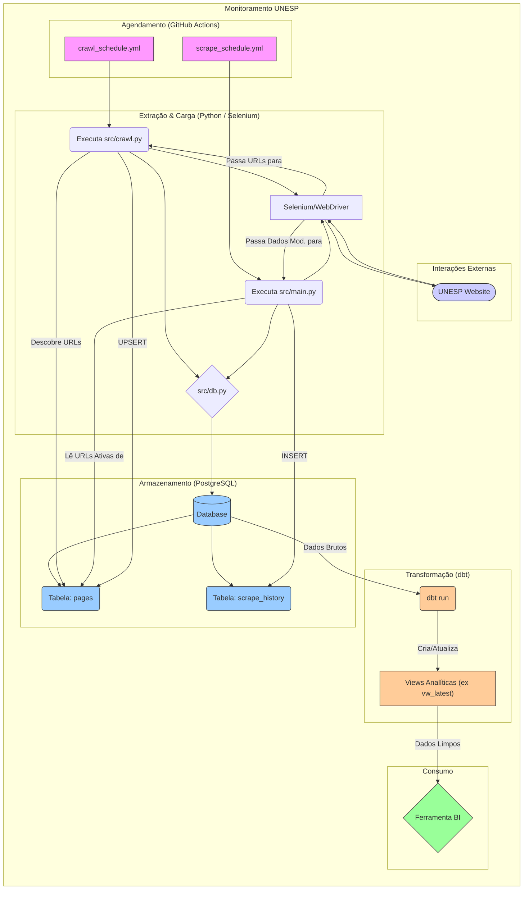

# Monitor de Conteúdo Web - Unesp Sorocaba

## Descrição

Este projeto realiza o _crawling_ e _scraping_ do site da Unesp de Sorocaba (`https://www.sorocaba.unesp.br/`) para monitorar as atualizações de conteúdo. O robô primeiro varre o site para descobrir todas as páginas e as salva em um banco de dados. Em seguida, ele visita cada página para extrair informações sobre a data da última modificação e o usuário responsável, armazenando um histórico dessas alterações.

### Diagrama do Fluxo (Mermaid):



## Como Clonar

```bash
git clone https://github.com/luizobara-unesp/webcrawling.git
cd webcrawling
```

## Tecnologias Utilizadas

- Linguagem: Python

## Bibliotecas:

- Selenium: Para automação do navegador e extração de conteúdo.

- SQLAlchemy: Para interação com o banco de dados PostgreSQL.

- psycopg2-binary: Driver PostgreSQL para Python.

- python-dotenv: Para gerenciamento de variáveis de ambiente.

## Instalação

Siga os passos abaixo para configurar o ambiente de desenvolvimento:

1. Crie um ambiente virtual:

```bash
python -m venv .venv
```

2. Ative o ambiente virtual:

- No Windows:

```bash
.venv\Scripts\activate
```

- No macOS/Linux:

```bash
source .venv/bin/activate
```

3. Instale as dependências:

```bash
pip install -r requirements.txt
```

4. **Configure o ChromeDriver**: Baixe o [ChromeDriver](https://googlechromelabs.github.io/chrome-for-testing/) compatível com sua versão do Google Chrome, coloque-o na pasta `drivers` do projeto e configure a variável de ambiente `LOCAL_DRIVER_PATH` conforme a seção Variáveis de Ambiente.

## Modo de Uso

O projeto possui dois scripts principais que devem ser executados em ordem:

1. `crawl.py` (Descoberta de Páginas): Execute este script para varrer o site e popular o banco de dados com todas as páginas encontradas.

```bash
python src/crawl.py
```

2. `main.py` (Extração de Dados): Após ter as páginas no banco, execute este script para extrair as informações de modificação de cada uma.

```bash
python src/main.py
```

## Próximos Passos

- [ ] Realizar uma forma de buscar/interagir com os dados diariamente.
- [ ] Tratar os dados coletados.
- [ ] Disponibilizar os dados em um dashboard ou tabela interativa para extração de insights sob demanda.

## Estrutura do Projeto

```bash
webcrawling/
├── .env.example       # Exemplo de arquivo para variáveis de ambiente
├── requirements.txt   # Lista de dependências Python
├── drivers/           # Pasta para armazenar o executável do WebDriver (ex: chromedriver.exe)
├── data/              # Armazena dados exportados (CSVs)
└── src/
    ├── crawl.py       # Script para descobrir e salvar as URLs do site
    ├── db.py          # Configuração da conexão com o banco de dados
    └── main.py        # Script principal para extrair dados das páginas
```

- `src/crawl.py`: Responsável por navegar pelo site, descobrir todas as sub-páginas e registrá-las no banco de dados.

- `src/db.py`: Módulo que centraliza a criação da `engine` do SQLAlchemy para conexão com o banco de dados PostgreSQL.

- `src/main.py`: Script que lê as URLs do banco de dados, acessa cada uma para extrair (fazer o scrape) das informações de última modificação e salva esses dados em uma tabela de histórico.

- `drivers/`: Pasta para armazenar o executável do WebDriver (ex: `chromedriver.exe`).

- `data/`: Diretório usado para salvar arquivos de dados, como o histórico de scraping em formato `.csv`.

## Variáveis de Ambiente

Para que o projeto funcione, crie um arquivo `.env` na raiz do projeto (baseado no `.env.example`) e defina as seguintes variáveis:

`DATABASE_URL`: A URL de conexão para o banco de dados PostgreSQL.

Formato: `postgres://<usuario>:<senha>@<host>:<porta>/<nome_do_banco>`

`LOCAL_DRIVER_PATH`: O caminho absoluto para o executável do `chromedriver` em seu sistema local.

Exemplo: `C:\Users\USER\projects\webcrawling\drivers\chromedriver.exe`
