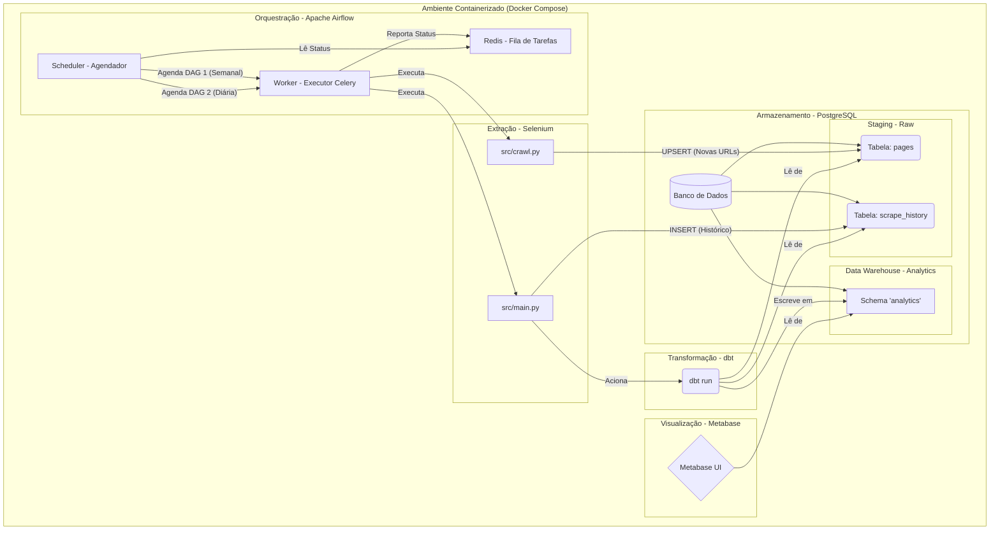

# Monitor de Conteúdo Web - Unesp Sorocaba

## Descrição

Este projeto é uma pipeline de dados ELT (Extract, Load, Transform) completa, projetada para monitorar a obsolescência de conteúdo (+1000 páginas) do portal da Unesp Sorocaba.
A solução é totalmente containerizada com Docker e orquestrada com Apache Airflow.

## O fluxo de dados opera da seguinte forma:

1. Extract & Load (Extração e Carga):
    - Uma DAG do Airflow (dag_1_weekly_discovery) executa um script Python (src/crawl.py) semanalmente para descobrir novas páginas (via Selenium) e realizar o UPSERT na tabela pages (Staging Area).
    - Uma segunda DAG (dag_2_daily_collection) executa um script (src/main.py) diariamente para raspar os metadados de modificação de todas as páginas ativas, inserindo os resultados em scrape_history.

2. Transform (Transformação):
    - Após a coleta diária, a mesma DAG dispara o dbt (dbt run).
    - O dbt lê os dados brutos da Staging Area (schema public) e os transforma em um Data Warehouse limpo e modelado (Star Schema) no schema analytics.

3. Consumption (Consumo):
    - O Metabase, também rodando via Docker, conecta-se diretamente ao Data Warehouse (schema analytics) para visualização de dados, permitindo a criação de dashboards interativos para identificar páginas obsoletas e seus responsáveis.

    
### Arquitetura da Pipeline (Mermaid):


```mermaid
graph TD
    subgraph "Ambiente Containerizado (Docker Compose)"
        direction LR
        subgraph "Orquestração - Apache Airflow"
            direction TB
            scheduler[Scheduler - Agendador]
            worker[Worker - Executor Celery]
            redis[Redis - Fila de Tarefas]
            
            scheduler -- "Agenda DAG 1 (Semanal)" --> worker
            scheduler -- "Agenda DAG 2 (Diária)" --> worker
            worker -- "Reporta Status" --> redis
            scheduler -- "Lê Status" --> redis
        end

        subgraph "Extração - Selenium"
            B[src/crawl.py]
            D[src/main.py]
        end

        subgraph "Armazenamento - PostgreSQL"
            direction TB
            H[(Banco de Dados)]
            subgraph "Staging - Raw"
                I(Tabela: pages)
                J(Tabela: scrape_history)
            end
            subgraph "Data Warehouse - Analytics"
                 L[Schema 'analytics']
            end
            
            H --> I & J & L
        end

        subgraph "Transformação - dbt"
            K(dbt run)
        end

        subgraph "Visualização - Metabase"
            M{Metabase UI}
        end
    end

    %% === Links da Pipeline ===
    worker -- "Executa" --> B
    worker -- "Executa" --> D
    B -- "UPSERT (Novas URLs)" --> I
    D -- "INSERT (Histórico)" --> J
    D -- "Aciona" --> K
    K -- "Lê de" --> I
    K -- "Lê de" --> J
    K -- "Escreve em" --> L
    M -- "Lê de" --> L
```

## 🧰 Tecnologias Utilizadas

| **Categoria**     | **Ferramenta**               | **Propósito** |
|--------------------|------------------------------|----------------|
| **Orquestração**   | Apache Airflow               | Agendamento, execução e monitoramento das pipelines (DAGs). |
| **Extração**       | Python & Selenium            | Scripts de crawling (descoberta) e scraping (coleta) de dados do site. |
| **Armazenamento**  | PostgreSQL                   | Banco de dados relacional usado como *Staging Area* (dados brutos) e *Data Warehouse* (dados analíticos). |
| **Transformação**  | dbt (*Data Build Tool*)      | Modelagem dos dados brutos em um *Data Warehouse* (*Star Schema*) via SQL. |
| **Visualização**   | Metabase                     | Ferramenta de BI para criação e visualização de dashboards. |
| **Ambiente**       | Docker & Docker Compose      | Containerização de todos os serviços (Airflow, Postgres, Metabase) para garantir portabilidade e isolamento. |

## 🚀 Instalação & Deploy (Servidor Linux)

Este projeto é projetado para rodar inteiramente com **Docker**.

---

1. Clonar o Repositório

```bash
git clone https://github.com/luizobara-unesp/webcrawling.git
cd webcrawling
```

---

2. Instalar o Docker

Siga o guia oficial de instalação do **Docker Engine** e do **Docker Compose** para seu servidor Linux.

---

3. Adicionar Usuário ao Grupo Docker (Pós-instalação)

Para rodar comandos Docker sem `sudo`:

```bash
sudo usermod -aG docker $USER
```

> ⚠️ Você precisará sair e logar novamente no servidor para que esta permissão tenha efeito.

---

4. Configurar Variáveis de Ambiente

Crie o arquivo `.env` a partir do exemplo. Este arquivo armazena todas as senhas e configurações:

```bash
cp .env.example .env
```

Edite o `.env` (`nano .env`) e preencha as variáveis.  
O `AIRFLOW_UID` é crucial para corrigir permissões de arquivo no Linux:

```bash
# ID de usuário do Airflow (Corrige permissões de log no Linux)
AIRFLOW_UID=50000

# Configurações do Banco de Dados
# (Usado pelo Airflow, Metabase, dbt e pelos scripts Python)
DB_HOST=postgres
DB_PORT=5432
DB_USER=airflow
DB_PASSWORD=airflow
DB_NAME=airflow
DB_SCHEMA=public
```

5. Subir o Ambiente

O primeiro *up* deve usar o comando `--build` para construir a imagem Docker customizada (com Selenium, Chrome e dbt) definida no `Dockerfile`.

```bash
docker compose up -d --build
```

---
6. Resetar a Senha do Airflow (Segurança)

Após os contêineres estarem *Healthy* (verifique com `docker compose ps`), mude a senha padrão (`airflow/airflow`) por uma senha segura:

```bash
docker compose exec airflow-scheduler airflow users reset-password --username airflow
```

---

## ⚙️ Modo de Uso

Após o deploy (`docker compose up`), a pipeline está **100% automatizada**.  
O gerenciamento é feito pelas interfaces web:

---

### 🌀 Orquestração (Airflow)

Acesse: `http://<ip-do-servidor>:8080`

Monitore as DAGs:
- `unesp_daily_collection`
- `unesp_weekly_discovery`

---

### 📊 Visualização (Metabase)

Acesse: `http://<ip-do-servidor>:3000`

#### 🧭 Setup (Primeira vez)
1. Crie sua conta de administrador.  
2. Quando perguntado, conecte-se ao banco de dados com os mesmos dados do arquivo `.env`  
   (Host: `postgres`, Usuário: `airflow`, etc.).  
3. Crie seus **dashboards** lendo as tabelas do schema `analytics`.

---

## 🧱 Estrutura do Projeto

A estrutura foi organizada para separar as responsabilidades da pipeline (**ELT**) e do ambiente.

```bash
webcrawling/
├── airflow/
│   ├── config/             # Configurações do Airflow (ex: airflow.cfg)
│   ├── dags/               # Definições das DAGs (ex: dag_1_weekly_discovery.py)
│   ├── logs/               # Logs gerados pelas tarefas do Airflow
│   └── plugins/            # Plugins customizados do Airflow (vazio)
│
├── src/
│   ├── crawl.py            # Script Python (E) para descoberta de novas páginas
│   ├── main.py             # Script Python (E+L) para scraping diário dos dados
│   └── db.py               # Configuração da conexão (SQLAlchemy)
│
├── unesp_analytics/        # Projeto dbt (T - Transformação)
│   ├── models/
│   │   ├── staging/        # Modelos de Staging (limpeza)
│   │   ├── marts/          # Modelos do Data Warehouse (dimensões e fatos)
│   │   └── analytics/      # Views finais para consumo
│   ├── dbt_project.yml     # Configuração principal do projeto dbt
│   └── profiles.yml        # Perfil de conexão do dbt (lê o .env)
│
├── .env                    # (Local) Chaves e senhas (ignorado pelo Git)
├── .env.example            # Template das variáveis de ambiente
├── docker-compose.yaml     # Orquestra todos os serviços (Postgres, Airflow, Metabase)
└── Dockerfile              # Define a imagem customizada (Airflow + Chrome + dbt)
```